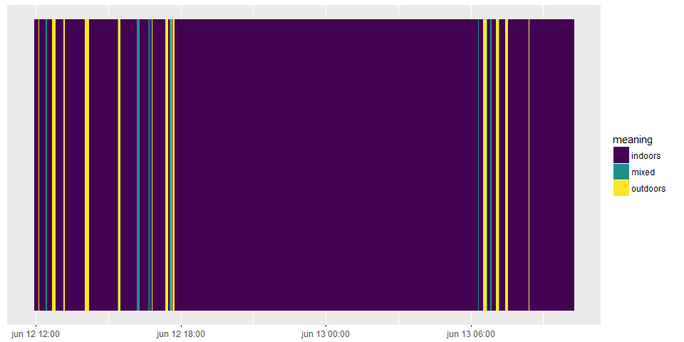
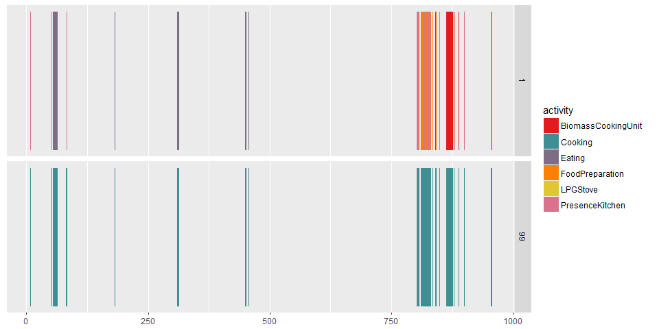
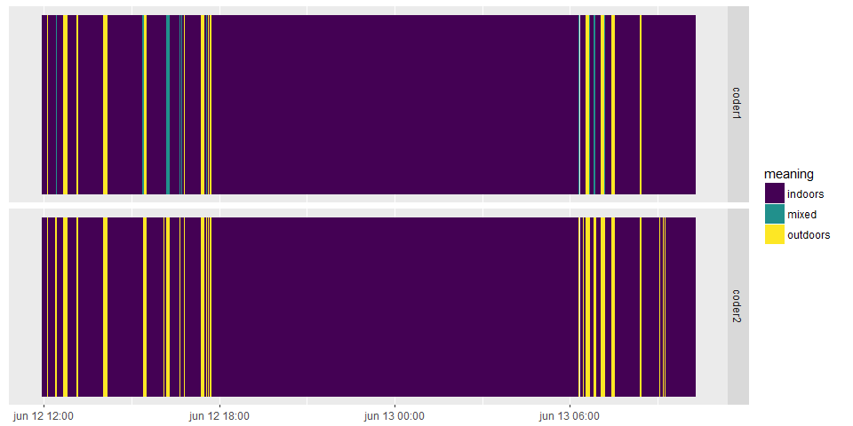

[](https://travis-ci.org/masalmon/watchme) [](https://ci.appveyor.com/project/masalmon/watchme) [](https://codecov.io/github/masalmon/watchme?branch=master)

Installation
============

``` r
library("devtools")
install_github("masalmon/watchme", build_vignettes=TRUE)
```

Introduction
============

This package aims at supporting robust and reproducible analysis of annotation results of wearable camera images. The workflow is as follows:

-   participants of a study wear a camera that automatically produces pictures;

-   these pictures are then annotated by coders using a list of annotations;

-   the results of these annotations are then used to e.g. reconstruct the sequence of activities of a person during the day, or link it to pollution exposure.

This R package supports the last step. How to calculate interrater reliability? How to plot the data? These are the processes that we want to code in the package, so that scientists from different projects can produce consistent results and get ideas from other projects. Every suggestion to expand the package is more than welcome, such as bug reports, if nicely written.

Data structure
==============

The structure of data in the package is adapted to data produced using the Doherty Sensecam Browser for annotation (see <https://sensecambrowser.codeplex.com/>) and works with data produced using the XnView MP software. However, input functions could be adapted for other formats.

The data needed for using the package are:

-   A list of possible annotation, called dicoCoding. It contains three columns Code, Meaning, Group. The Code is the unique X-digit identifier of an activity. The Meaning, preferably in a single word such as washingYourTeeth, explains the code. The Group allows to group activities into meaningful categories, i.e. washingYourTeeth and washingYourHands could be in the hygiene Group whereas eatingRealFood and snackingOnCheapChocolate could be in the eating Group. If you do not use abbreviations or code, Code and Meaning can be equal.

``` r
pathDicoCoding <-  system.file("extdata", "dicoCoding_pinocchio.csv", package = "watchme")
sepDicoCoding <- ";"
dicoCoding <- read.table(pathDicoCoding, sep=sepDicoCoding, header=TRUE)
kable(head(dicoCoding))
```

| Code | Meaning            |  Group|
|:-----|:-------------------|------:|
| 01A  | BiomassCookingUnit |      1|
| 01B  | LPGStove           |      1|
| 01C  | OtherCookingUnit   |      1|
| 02B  | PresenceKitchen    |      1|
| 02A  | FoodPreparation    |      1|
| 03A  | Eating             |      1|

-   A table of coding results. The columns are name, image\_path, image\_time, annotation, as provided by a SQL query of the Doherty database. The column name is a repetition of the participant name. The column image\_path indicates the path to the picture, or its name. It only needs to be unique for each picture. The column image\_time gives the date and time at which the picture was taken. The column annotation gives the code(s) associated with the picture. They can be pasted one after another, since we will use grepl() for finding the unique X-digit identifiers, or they can be on separate lines, since all codes for one picture identified by one picture\_name will be merged.

``` r
library("dplyr")
pathResults <- system.file("extdata", "image_level_pinocchio.csv", package = "watchme")
sepResults <- ","
codingResults <- read.table(pathResults, sep=sepResults, header=TRUE)
codingResults <- dplyr::tbl_df(codingResults)
kable(head(codingResults, n=9))
```

| name      | image\_path                                                                               | image\_time         | annotation         |
|:----------|:------------------------------------------------------------------------------------------|:--------------------|:-------------------|
| pinocchio |                                                                                           | 1991-01-23 08:02:00 |                    |
| pinocchio | C:3\_33456\_01\_030615\_AG\_C015-06-04 08-36-32\\B00000000\_21I6LW\_20150603\_084228E.JPG | 2015-06-03 08:42:28 |                    |
| pinocchio | C:3\_33456\_01\_030615\_AG\_C015-06-04 08-36-32\\B00000001\_21I6LW\_20150603\_084228E.JPG | 2015-06-03 08:42:28 |                    |
| pinocchio | C:3\_33456\_01\_030615\_AG\_C015-06-04 08-36-32\\B00000002\_21I6LW\_20150603\_084236E.JPG | 2015-06-03 08:42:36 |                    |
| pinocchio | C:3\_33456\_01\_030615\_AG\_C015-06-04 08-36-32\\B00000003\_21I6LW\_20150603\_084313E.JPG | 2015-06-03 08:43:13 |                    |
| pinocchio | C:3\_33456\_01\_030615\_AG\_C015-06-04 08-36-32\\B00000004\_21I6LW\_20150603\_084349E.JPG | 2015-06-03 08:43:49 |                    |
| pinocchio | C:3\_33456\_01\_030615\_AG\_C015-06-04 08-36-32\\B00000005\_21I6LW\_20150603\_084429E.JPG | 2015-06-03 08:44:29 |                    |
| pinocchio | C:3\_33456\_01\_030615\_AG\_C015-06-04 08-36-32\\B00000006\_21I6LW\_20150603\_084509E.JPG | 2015-06-03 08:45:09 | 01.CK;02B. Kitchen |
| pinocchio | C:3\_33456\_01\_030615\_AG\_C015-06-04 08-36-32\\B00000007\_21I6LW\_20150603\_084624E.JPG | 2015-06-03 08:46:24 |                    |

From input data to `wearableCamImages` objects
==============================================

Using both these inputs, we create an object of the S4 class `wearableCamImages` on which operations will be performed.

The object has the following slots:

-   `participantID` which is extracted from the name column in the coding results. However, this slot can be changed manually.

-   `imagePath` which is a vector of `character` giving the path to or the name of the picture.

-   `timeDate` which is a vector of `POSIXct` giving the date and time at which the picture was taken. It is generated using the `lubridate` package.

-   `codes` which is a vector of `character` giving all codes associated with an image, separated by commas.

-   `codesBinaryVariables` which is a `data.frame` of boolean. Each column corresponds to a code, and each line corresponds to a picture. Each cell at line i and at column j thus indicates whether the code j was attributed to the image i.

-   `dicoCoding` which is the list of annotations whose structure was previously presented. It is very important to have it stored in the same object as the coding results, since it explains the meaning of the results. Without `dicoCoding`, results do not make any sense. Likewise, it is important for comparable `wearableCamImages` objects to have the same `dicoCoding`, because comparing coding results obtained with different lists of annotations would not make any sense.

The function used to create a `wearableCamImages` object is called `convertInput`.

For finding both inputs and interpreting them the `convertInput` function needs to know the paths to each file, `pathResults` and `pathDicoCoding` and the separator used in each of them, `sepResults` and `sepDicoCoding`. For the file with coding results, it is important to say whether date are given in the "ymd" (year, month, day, no matter the separator) or "dmy" (day, month, year, no matter the separator), the default being "ymd".

Below we illustrate the use of `convertInput`.

``` r
library("watchme")
pathResults <- system.file("extdata", "image_level_pinocchio.csv", package = "watchme")
sepResults <- ","
pathDicoCoding <-  system.file("extdata", "dicoCoding_pinocchio.csv", package = "watchme")
sepDicoCoding <- ";"
wearableCamImagesObject <- convertInput(pathResults=pathResults, sepResults=sepResults,
              pathDicoCoding=pathDicoCoding, sepDicoCoding=sepDicoCoding)
class(wearableCamImagesObject)
```

    ## [1] "wearableCamImages"
    ## attr(,"package")
    ## [1] "watchme"

From `wearableCamImages` to table of events
===========================================

Using the annotations from the images, when can easily deduce a sequence of events. For instance having two subsequent pictures of washingYourTeeth taken at respectively t1 and t2 would be interpreted as having a washingYourTeeth event from t1 to t2. The `toEventLevel` allows the conversion from a `wearableCamImages` object to a table (`dplyr` class `tbl_df`) with

-   event index from 1 to the number of events

-   start time (`POSIXt`),

-   end time (`POSIXt`),

-   eventCode (`character`),

-   startPicture and endPicture,

-   noOfPictures in the event.

If pictures have several codes, then there can be synchronous events.

The function `toEventLevel` takes two arguments: the `wearableCamImages` object and a minimal duration for the events, in pictures, which is called `minDuration`. Below are two examples of use using a dummy `wearableCamImages` object that we have put in the package.

``` r
data("dummyWearableCamImages")
eventTable <- toEventLevel(wearableCamImagesObject=dummyWearableCamImages)
kable(head(eventTable))
```

|  eventIndex| startTime           | endTime             | eventCode |  noOfPictures| activity           | group |  startPicture|  endPicture|
|-----------:|:--------------------|:--------------------|:----------|-------------:|:-------------------|:------|-------------:|-----------:|
|           1| 2015-06-03 09:37:53 | 2015-06-03 09:37:53 | 01A       |             1| BiomassCookingUnit | 1     |            83|          83|
|           2| 2015-06-04 06:16:37 | 2015-06-04 06:16:37 | 01A       |             1| BiomassCookingUnit | 1     |           806|         806|
|           3| 2015-06-04 06:42:46 | 2015-06-04 06:43:24 | 01A       |             2| BiomassCookingUnit | 1     |           841|         842|
|           4| 2015-06-04 07:01:41 | 2015-06-04 07:02:14 | 01A       |             2| BiomassCookingUnit | 1     |           863|         864|
|           5| 2015-06-04 07:03:37 | 2015-06-04 07:04:51 | 01A       |             3| BiomassCookingUnit | 1     |           866|         868|
|           6| 2015-06-04 07:06:09 | 2015-06-04 07:09:14 | 01A       |             6| BiomassCookingUnit | 1     |           870|         875|

``` r
eventTable2 <- toEventLevel(wearableCamImagesObject=dummyWearableCamImages, minDuration = 2)
kable(head(eventTable2))
```

|  eventIndex| startTime           | endTime             | eventCode |  noOfPictures| activity           | group |  startPicture|  endPicture|
|-----------:|:--------------------|:--------------------|:----------|-------------:|:-------------------|:------|-------------:|-----------:|
|           3| 2015-06-04 06:42:46 | 2015-06-04 06:43:24 | 01A       |             2| BiomassCookingUnit | 1     |           841|         842|
|           4| 2015-06-04 07:01:41 | 2015-06-04 07:02:14 | 01A       |             2| BiomassCookingUnit | 1     |           863|         864|
|           5| 2015-06-04 07:03:37 | 2015-06-04 07:04:51 | 01A       |             3| BiomassCookingUnit | 1     |           866|         868|
|           6| 2015-06-04 07:06:09 | 2015-06-04 07:09:14 | 01A       |             6| BiomassCookingUnit | 1     |           870|         875|
|          10| 2015-06-04 06:26:13 | 2015-06-04 06:29:03 | 01B       |             4| LPGStove           | 1     |           818|         821|
|          11| 2015-06-04 06:31:28 | 2015-06-04 06:34:16 | 01B       |             5| LPGStove           | 1     |           824|         828|

Plotting a table of events
==========================

The package provides a function using the R `ggplot2` package for plotting sequences of events. It is quite basic now but could get fancier, maybe even use interactive graphs libraries such as `plotly` or `rCharts`. The function is called `plotSequence` and has the following arguments:

-   `eventTable` which is the table of events to be plotted. It can have been generated by `toEventLevel`, otherwise it simply needs to be a `tbl_df` object with the right column names. It can also have been generated by `bindCoders` and therefore have a column with the coder name.

-   `doNotUseCode` which is a vector of codes that one does not want to plot. This would allow the user to e.g. not show the snackingOnCheapChocolate events by providing its unique X-digit identifier.

-   `xAxis` which allows one to choose whether the events should be plotted against the indices of the pictures, or time. It should thus be "time" or "picture". The default is "time".

-   `facettingGroup` is a Boolean that indicates whether one wants to have several facets each corresponding to a group of codes. Thus eating and hygiene could get their own facet.

-   `facettingCoder` is a Boolean that indicates whether one wants to have several facets each corresponding to a coder. If you provide a `eventTable` with a column for the coder names, it is advised to set this to TRUE, otherwise you're plotting several intepretations of the pictures on the same graph, with the same colours.

-   `dicoCoding` is an optional argument but is strongly advised. If you provide dicoCoding, then the same colour will always be attributed to each code. If you plot several `eventTable`s, part of which e.g. do not have washingYourTeeth, you still want to always see the same colour for washingYourHands.

-   `cbbPaletteYes` is a makeshift argument now. In the case in which you provide a dicoCoding with less than 7 activities, you can set this to TRUE and get a colour-blind palette, that is less pink-purple than the default palette.

It returns a `ggplot` object.

Below are several examples.

``` r
data("dummyWearableCamImages")
library("ggplot2")
eventTable <- toEventLevel(wearableCamImagesObject=dummyWearableCamImages)
plotSequence(eventTable, dicoCoding = dummyWearableCamImages@dicoCoding)
```



``` r
plotSequence(eventTable, xAxis="picture", facettingGroup=TRUE, 
             cbbPaletteYes = FALSE, dicoCoding = dummyWearableCamImages@dicoCoding)
```


For plotting results from more than one coder, one has to start by creating a table of events containing all the results using the `bindCoders`function that takes a list of `wearableCamImages` objects as input, as well as a `minDuration` for events (in pictures).

``` r
data("IO1")
data("IO2")
eventTableCoders <- bindCoders(list(IO1, IO2), minDuration = 1)
plotSequence(eventTableCoders, facettingGroup = TRUE, facettingCoder = TRUE,
             dicoCoding=IO1@dicoCoding)
```



Calculating interrater reliability
==================================

An important aspect of coding images is having a list of annotations that provides consistent results acrossed (trained) coders, or raters. Therefore one needs to check and report interrater reliability.

Simply look at disagreements
----------------------------

In the package there is a function for getting the times and codes of pictures for which coders disagree, which might be useful for exploring differences when e.g. training coders.

``` r
data("IO1")
data("IO2")
listWC <- list(IO1, IO2)
namesList <- c("Cain", "Abel")
differences <- outputDifferences(listWC, namesList)
kable(differences[1:10,])
```

| imageTime           | Cain        | Abel     |
|:--------------------|:------------|:---------|
| 2015-06-12 12:23:40 | indoors     | outdoors |
| 2015-06-12 12:24:59 | mixed       | outdoors |
| 2015-06-12 12:25:34 | mixed       | outdoors |
| 2015-06-12 13:08:17 | mixed       | outdoors |
| 2015-06-12 13:10:01 | outdoors    | indoors  |
| 2015-06-12 15:19:45 | non codable | indoors  |
| 2015-06-12 15:23:47 | mixed       | outdoors |
| 2015-06-12 15:24:23 | mixed       | outdoors |
| 2015-06-12 15:24:55 | mixed       | outdoors |
| 2015-06-12 16:06:08 | indoors     | outdoors |

Assess interrater reliability
-----------------------------

Nowadays the state of the art is to use Cohen's kappa for codes attributed to pictures, even if they are not independent (Aiden Doherty's personal communication). In the package we provide a function for calculating interrater reliability (or IRR) this way, which is called `irrWatchme`. It uses functions of the R `irr` package. It allows using several possibilities for defining what codes are to be compared:

-   one could compare the global annotations of all files, i.e. all codes at the same time. For instance compare washingYourTeeth; readingABook to washingYourTeeh; readingAMagazine for picture 1 between coder A and coder B. This is the default option.

-   one could merge all codes from a group for each picture. So we would compare eatingBadFood; drinkingWater to eatingBadFood even if the complete annotation are eatingBadFood, drinkingWater; readingABook and eatingBadFood; readingABook. For this one needs to set the `byCode` argument to TRUE.

-   one could look separately at each code using binary variables. For instance for washingYourTeeth comparing TRUE to TRUE and for readingABook TRUE to FALSE. For this one needs to set the `byGroup` argument to TRUE but the `byCode` argument to FALSE.

In the case in which wants to compare results provided by more than two coders, another choice to be made is whether all coders are to be compared together using Fleiss Kappa, or one to one using Cohen's kappa. This is set with the `oneToOne` Boolean argument.

The comparison one wants to make depends on the context of the calculation of the IRR. When developping a new list of annotations one wants to see interrater reliability for each code, later when may want to report a single figure for the whole list of annotations.

Below are a few examples for two coders to be compared.

The default is to compare all annotations together.

``` r
library("xtable")
data("IO1")
data("IO2")
listWC <- list(IO1, IO2)
namesList <- c("Cain", "Abel")
IRR <- irrWatchme(listWC, namesList=namesList)
kable(IRR)
```

| method                                           |  pictures|  agreedOn|  raters| ratersNames   |       Kappa|          z|  pValue|
|:-------------------------------------------------|---------:|---------:|-------:|:--------------|-----------:|----------:|-------:|
| Cohen's Kappa for 2 Raters (Weights: unweighted) |      1263|        28|       2| Cain and Abel |  -0.0422707|  -16.95465|       0|

Here we compare annotations by group of codes. One gets a list of as many tables as there are groups.

``` r
IRR <- irrWatchme(listWC, namesList=c("Cain", "Abel"), oneToOne=TRUE, byGroup=TRUE)
lapply(IRR, kable)
```

$`indoor outdoor`

| method                                           |  pictures|  agreedOn|  raters| ratersNames   |       Kappa|          z|  pValue|
|:-------------------------------------------------|---------:|---------:|-------:|:--------------|-----------:|----------:|-------:|
| Cohen's Kappa for 2 Raters (Weights: unweighted) |      1263|        28|       2| Cain and Abel |  -0.0422707|  -16.95465|       0|

$`non codable`

| method                                           |  pictures|  agreedOn|  raters| ratersNames   |       Kappa|          z|  pValue|
|:-------------------------------------------------|---------:|---------:|-------:|:--------------|-----------:|----------:|-------:|
| Cohen's Kappa for 2 Raters (Weights: unweighted) |      1263|        28|       2| Cain and Abel |  -0.0422707|  -16.95465|       0|

Here we compare annotations by code. One gets a list of as many tables as there are codes.

``` r
IRR <- irrWatchme(listWC, namesList=c("Cain", "Abel"), oneToOne=TRUE, byCode=TRUE)
lapply(IRR, kable)
```

$indoors

| method                                           |  pictures|  agreedOn|  rater1YesRater2No|  rater1NoRater2Yes|  raters| ratersNames   |      Kappa|         z|  pValue|
|:-------------------------------------------------|---------:|---------:|------------------:|------------------:|-------:|:--------------|----------:|---------:|-------:|
| Cohen's Kappa for 2 Raters (Weights: unweighted) |      1263|      1251|                  9|                  3|       2| Cain and Abel |  0.9430487|  33.52833|       0|

$outdoors

| method                                           |  pictures|  agreedOn|  rater1YesRater2No|  rater1NoRater2Yes|  raters| ratersNames   |      Kappa|        z|  pValue|
|:-------------------------------------------------|---------:|---------:|------------------:|------------------:|-------:|:--------------|----------:|--------:|-------:|
| Cohen's Kappa for 2 Raters (Weights: unweighted) |      1263|      1232|                  1|                 30|       2| Cain and Abel |  0.8296414|  29.8661|       0|

$`in vehicle`

| method                                           |  pictures|  agreedOn|  rater1YesRater2No|  rater1NoRater2Yes|  raters| ratersNames   |  Kappa|    z|  pValue|
|:-------------------------------------------------|---------:|---------:|------------------:|------------------:|-------:|:--------------|------:|----:|-------:|
| Cohen's Kappa for 2 Raters (Weights: unweighted) |      1263|      1263|                  0|                  0|       2| Cain and Abel |    NaN|  NaN|     NaN|

$mixed

| method                                           |  pictures|  agreedOn|  rater1YesRater2No|  rater1NoRater2Yes|  raters| ratersNames   |  Kappa|    z|  pValue|
|:-------------------------------------------------|---------:|---------:|------------------:|------------------:|-------:|:--------------|------:|----:|-------:|
| Cohen's Kappa for 2 Raters (Weights: unweighted) |      1263|      1241|                 22|                  0|       2| Cain and Abel |      0|  NaN|     NaN|

$`non codable`

| method                                           |  pictures|  agreedOn|  rater1YesRater2No|  rater1NoRater2Yes|  raters| ratersNames   |      Kappa|         z|  pValue|
|:-------------------------------------------------|---------:|---------:|------------------:|------------------:|-------:|:--------------|----------:|---------:|-------:|
| Cohen's Kappa for 2 Raters (Weights: unweighted) |      1263|      1262|                  1|                  0|       2| Cain and Abel |  0.9226814|  32.88936|       0|

And then for more than two coders. If we do the comparison one by one, the resulting table has as many lines as there are possible pairs of coders. Here we compare all annotations together but even when comparing more than two coders you can do it by group of codes or by code.

``` r
data("IO3")
listWC2 <- list(IO1, IO2, IO3)
namesList <- c("Riri", "Fifi", "Loulou")
IRR <- irrWatchme(listWC2, namesList=namesList)
kable(IRR)
```

| method                     |  pictures|  agreedOn|  raters| ratersNames        |       Kappa|          z|  pValue|
|:---------------------------|---------:|---------:|-------:|:-------------------|-----------:|----------:|-------:|
| Fleiss' Kappa for m Raters |      1263|        19|       3| Riri, Fifi, Loulou |  -0.2875235|  -20.28196|       0|

``` r
IRR2 <- irrWatchme(listWC2, namesList=namesList, oneToOne=TRUE)
kable(IRR2)
```

| method                                           |  pictures|  agreedOn| rater1 | rater2 |       Kappa|          z|  pValue|
|:-------------------------------------------------|---------:|---------:|:-------|:-------|-----------:|----------:|-------:|
| Cohen's Kappa for 2 Raters (Weights: unweighted) |      1263|        28| Riri   | Fifi   |  -0.0422707|  -16.95465|       0|
| Cohen's Kappa for 2 Raters (Weights: unweighted) |      1263|      1263| Riri   | Loulou |   1.0000000|   37.02157|       0|
| Cohen's Kappa for 2 Raters (Weights: unweighted) |      1263|        28| Fifi   | Loulou |  -0.0422707|  -16.95465|       0|

Conclusion
==========

The package is meant to be improved and expanded as the CHAI project goes on. We want our code to be:

-   reproducible, which is why we publish it as a R package.

-   robust, which is why we added tests using the `testthat` package, and which is why we need to hear bug reports.

-   well documented. So if you have remarks about the documentation and this vignette, do not hesitate to contact us!

-   a work in progress, using your suggestions about needed functionalities.

-   the reference for analysing such a data not because we're over-ambitious, but because we think that the field of wearable camera images analysis will gain for having a platform for exchangig code.

So please do participate in the development of this R package! :-)
